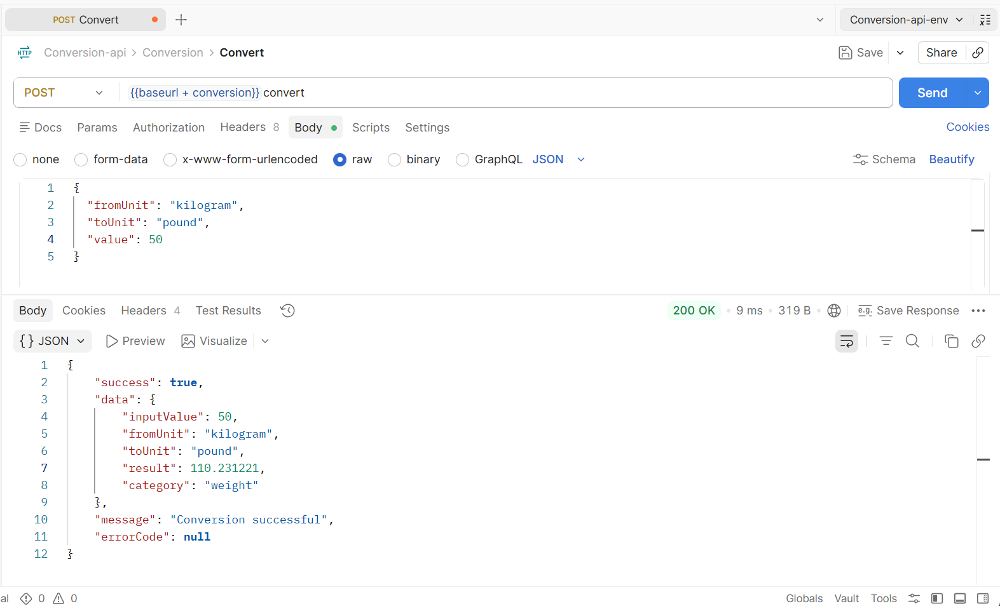
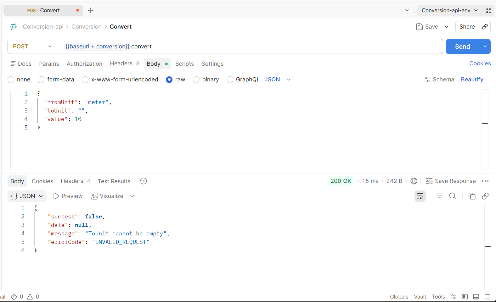
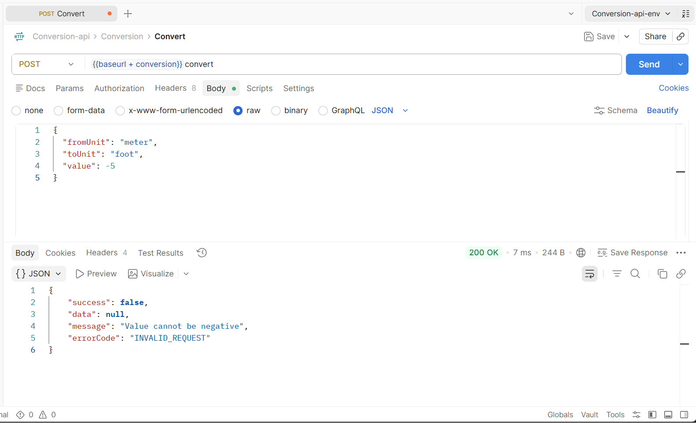
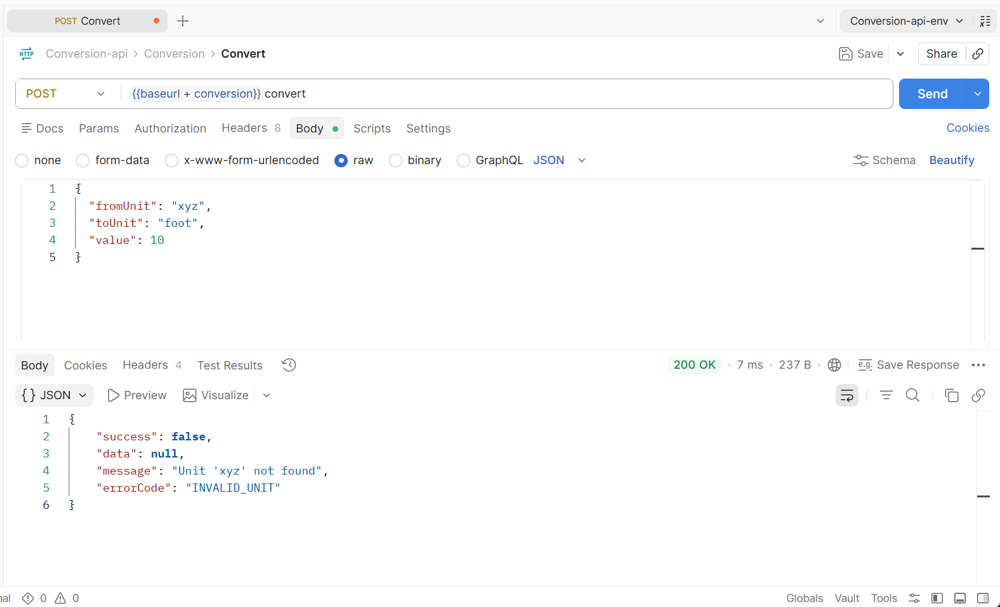
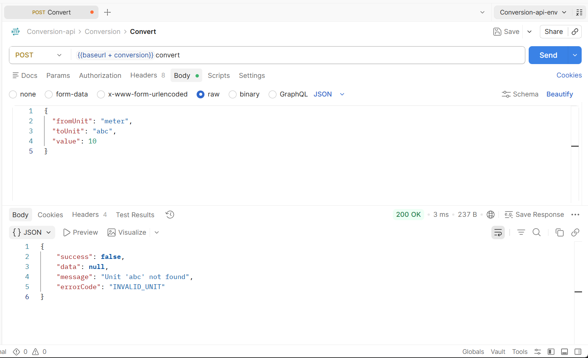
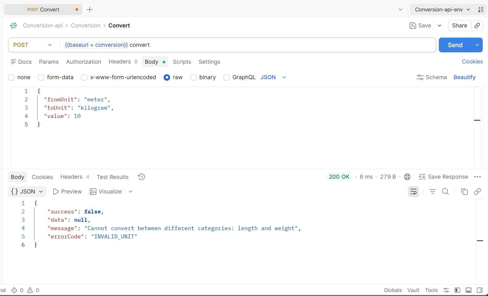

# unit-conversion-assignment

## Description

A simple unit conversion API that converts values between different units across multiple categories.

- Supports length, weight, and temperature conversions
- Easy to extend with new unit categories
- Built with .NET and follows clean architecture principles

## How to Run Locally

### Prerequisites
- .NET 10.0 or higher installed

### Steps

1. Clone or download the project
2. Navigate to the project folder:
   ```
   cd UnitConversion.API
   ```
3. Restore dependencies:
   ```
   dotnet restore
   ```
4. Run the application:
   ```
   dotnet run
   ```
5. The API will be available at `http://localhost:5145`

## API Endpoint

- **POST** `/api/conversion/convert`
- Send JSON with `fromUnit`, `toUnit`, and `value`

### Example Request
```json
{
  "fromUnit": "meter",
  "toUnit": "foot",
  "value": 10
}
```

## Design Decisions

- **Strategy Pattern** - Each conversion type (length, weight, temperature) has its own strategy for flexibility
- **Factory Pattern** - Central factory manages strategy selection based on category
- **Separate Layers** - Provider, Service, and Controller layers keep concerns separated
- **Base Unit Conversion** - Length and weight use base units to avoid complex conversion matrices

## Solution Approach

### Step 1: Build Basic Structure
Started with a simple working API:
- Set up the project and API structure
- Created one conversion type (length) to test the flow

### Step 2: Add More Conversions
Expanded to support multiple types:
- Added weight conversions (kilogram, pound, etc.)
- Added temperature conversions (Celsius, Fahrenheit, Kelvin)

### Step 3: Clean Up Code with Patterns
Improved code organization:
- Removed repeated if-else code
- Used Strategy pattern for each conversion type
- Used Factory pattern to pick the right conversion method

### Step 4: Handle Errors Properly
Made the API reliable:
- Added error catching for bad requests
- Created consistent response format for success and failure
- Added input validation to check data before converting

### Step 5: Add Documentation
Documented everything:
- Updated README with instructions
- Explained design choices and tradeoffs

## Trade-offs

- Strategy instances are created fresh each time (could be cached for performance if needed)
- Simple in-memory provider (could be replaced with database in future)

## API Testing Screenshots

### Success Response


### Validation Errors

#### Empty FromUnit


#### Empty ToUnit


#### Negative Value


#### Invalid FromUnit


#### Invalid ToUnit


#### Category Mismatch

